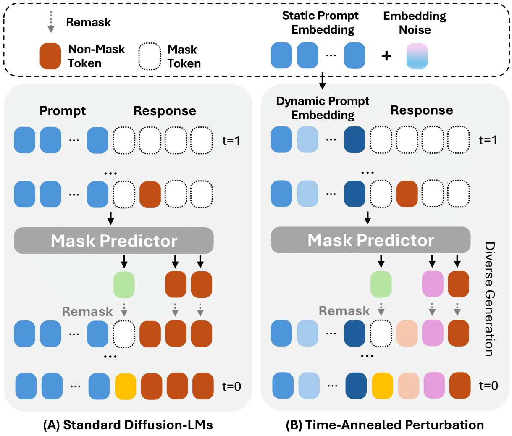

# Time-Annealed Perturbation Sampling: Diverse Generation for Diffusion Language Models

**T**ime-**A**nnealed **P**erturbation **S**ampling (TAPS) is an inference-time method for improving **diversity** in diffusion language models without
sacrificing generation quality.

This repository contains the official implementation of TAPS and the code used to reproduce experiments reported in the paper.

---

# Method Overview



*A conceptual comparison of the inference process between the base Diffusion-LM and our proposed method, TAPS, illustrating different context conditioning behaviors.*

---

# Supported Backbones

This repository supports two diffusion language model backbones:

- **[LLaDA-8B-Instruct](https://huggingface.co/GSAI-ML/LLaDA-8B-Instruct)** — loaded via `transformers.AutoModel`
- **[TraDo-8B-Instruct](https://huggingface.co/Gen-Verse/TraDo-8B-Instruct)** — loaded via `transformers.AutoModelForCausalLM`

---

## Benchmarks

- **GSM8K**
- **WritingPrompts**
- **NoveltyBench**
- **Arena-Hard-Auto**

---

## Reproduce: WritingPrompts

### LLaDA

```bash
accelerate launch benchmarks/writingprompts/run_diversity.py \
  --backbone llada \
  --model_path /path/to/llada \
  --mode embedding \
  --temperature 0.8 \
  --steps 128 --gen_length 256 --block_length 32 \
  --cond_noise_start 0.05 --cond_noise_until 0.95 \
  --cond_noise_anneal cosine \
  --cond_embed_noise_std 0.05 --cond_embed_psi 1.0 \
  --num_prompts 50 --num_samples 8 \
  --out_dir outputs/wp
```

### TraDo

```bash
accelerate launch benchmarks/writingprompts/run_diversity.py \
  --backbone trado \
  --model_path /path/to/trado \
  --mode embedding \
  --temperature 0.8 \
  --steps 128 --gen_length 256 --block_length 4 \
  --cond_noise_start 0.05 --cond_noise_until 0.95 \
  --cond_noise_anneal cosine \
  --cond_embed_noise_std 0.20 --cond_embed_psi 1.0 \
  --top_k 50 --top_p 0.9 --min_p 0.0 \
  --num_prompts 50 --num_samples 8 \
  --out_dir outputs/wp

```


## License

This project is released under the **MIT License**.See the [LICENSE](./LICENSE) file for the full text.

```text
SPDX-License-Identifier: MIT
```
