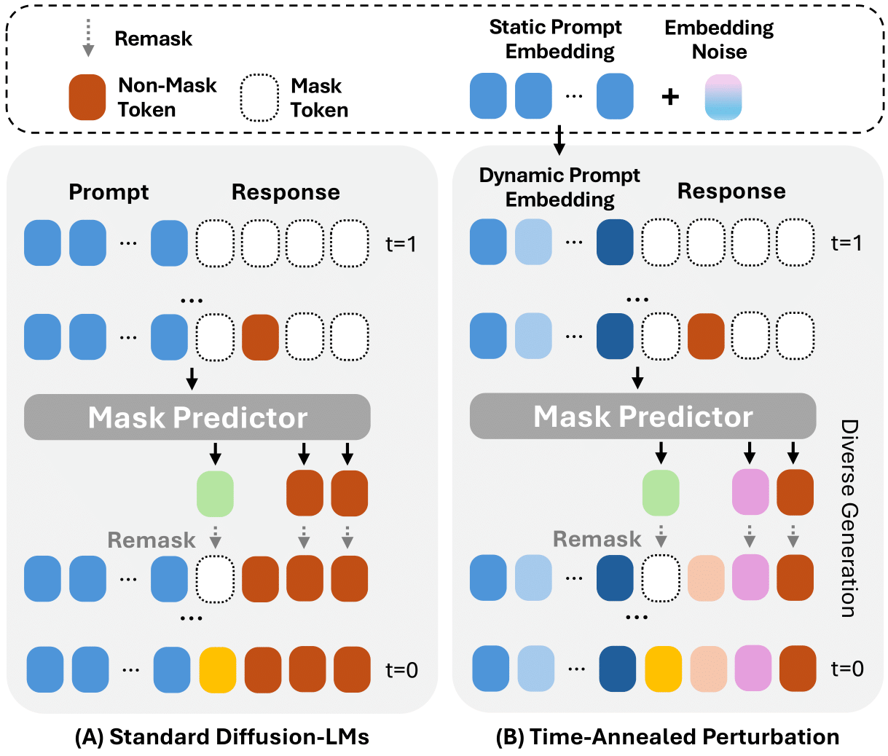

# Time-Annealed Perturbation Sampling: Diverse Generation for Diffusion Language Models

[](https://taps-dlm.github.io) [](https://arxiv.org/abs/2601.22629) [](./LICENSE)

**T**ime-**A**nnealed **P**erturbation **S**ampling (TAPS) is an inference-time method for improving **diversity** in diffusion language models without sacrificing generation quality.

This repository contains the official implementation of TAPS and the code used to reproduce experiments reported in the paper.

---

## Method Overview



*A conceptual comparison of the inference process between the base Diffusion-LM and our proposed method, TAPS, illustrating different context conditioning behaviors.*

---

## Supported Backbones

This repository supports two diffusion language model backbones:

| Backbone                    | Hugging Face                                                                   | Loader                                |
| --------------------------- | ------------------------------------------------------------------------------ | ------------------------------------- |
| **LLaDA-8B-Instruct** | [GSAI-ML/LLaDA-8B-Instruct](https://huggingface.co/GSAI-ML/LLaDA-8B-Instruct)     | `transformers.AutoModel`            |
| **TraDo-8B-Instruct** | [Gen-Verse/TraDo-8B-Instruct](https://huggingface.co/Gen-Verse/TraDo-8B-Instruct) | `transformers.AutoModelForCausalLM` |

---

## Environment Setup

This project uses two separate Python environments:

- `llada`: for LLaDA-related experiments
- `trado`: for TraDo-related experiments

```bash
# Clone the repository
git clone https://github.com/Johnny221B/TAPS.git
cd TAPS

# Create the llada environment
python -m venv envs/llada
source envs/llada/bin/activate
pip install --upgrade pip
pip install -r requirements_llada.txt

# Create the trado environment
python -m venv envs/trado
source envs/trado/bin/activate
pip install --upgrade pip
pip install -r requirements_trado.txt
```

---

## Benchmarks

- **GSM8K**
- **WritingPrompts**
- **NoveltyBench**
- **Arena-Hard-Auto**

---

## Reproduce: WritingPrompts

### LLaDA

```bash
bash scripts/run_llada.sh
```

### TraDo

```bash
bash scripts/run_trado.sh
```

---

## Citation

```bibtex
@misc{wu2026timeannealedperturbationsamplingdiverse,
      title={Time-Annealed Perturbation Sampling: Diverse Generation for Diffusion Language Models}, 
      author={Jingxuan Wu and Zhenglin Wan and Xingrui Yu and Yuzhe Yang and Yiqiao Huang and Ivor Tsang and Yang You},
      year={2026},
      eprint={2601.22629},
      archivePrefix={arXiv},
      primaryClass={cs.CL},
      url={https://arxiv.org/abs/2601.22629}, 
}

```

## License

This project is released under the **MIT License**. See the [LICENSE](./LICENSE) file for the full text.

```
SPDX-License-Identifier: MIT
```
